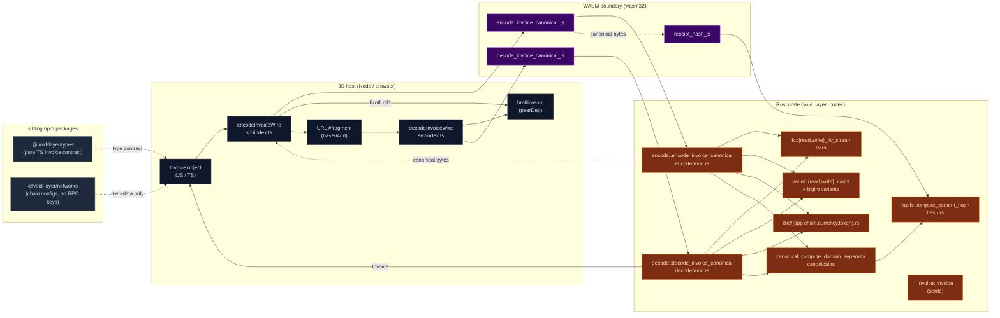
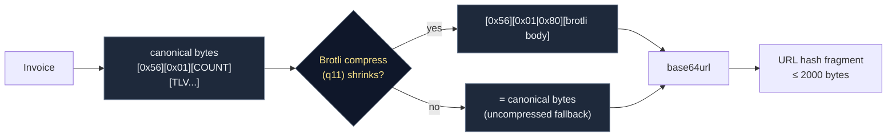
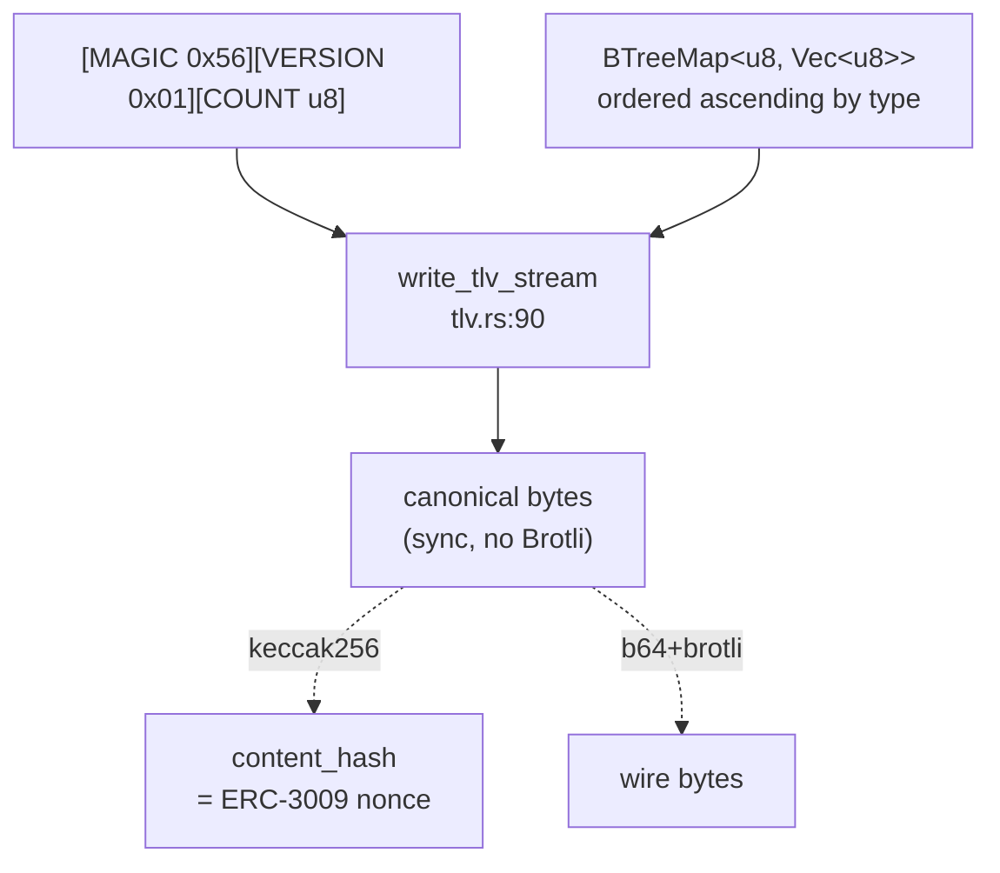
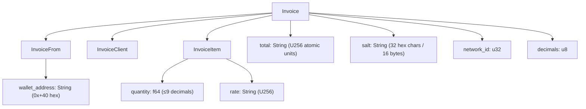
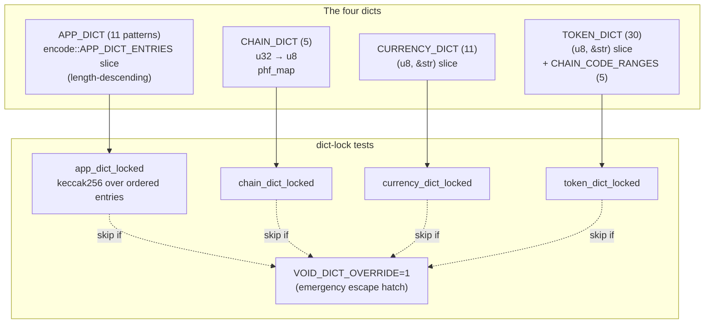
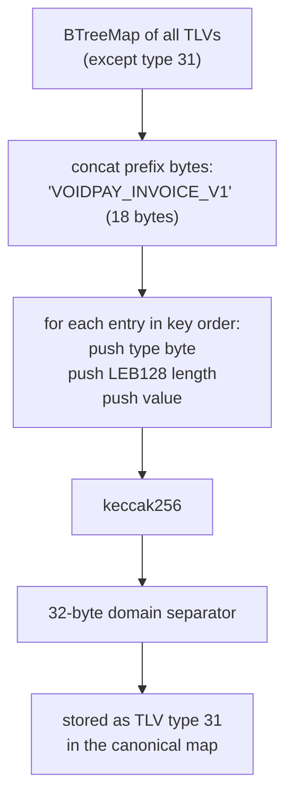
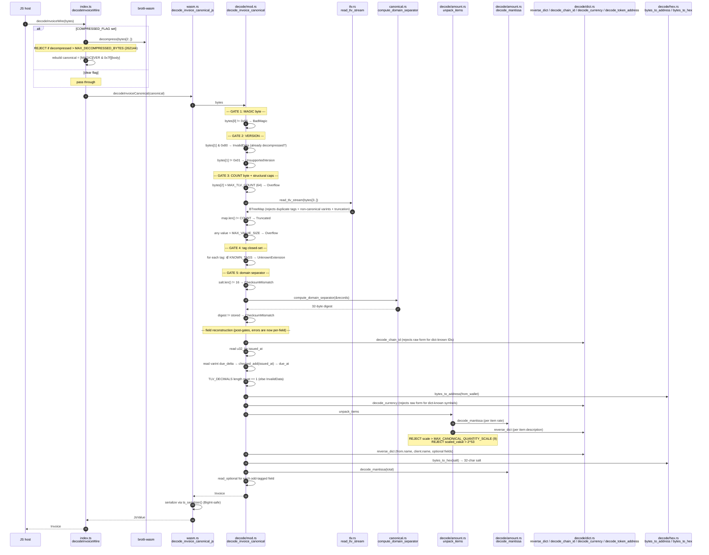

# @void-layer/codec — Deep Architecture Map

> A function-level walkthrough for one human reader. Companion to
> [`architecture-overview.md`](./architecture-overview.md) (high-level) and
> [`architecture.canvas`](./architecture.canvas) (spatial). Read this in one
> sitting. Skim once for shape, re-read once for detail.
>
> **Audience**: you (Ignat), after a few weeks away from the code, wanting to
> trace any user-visible payment URL operation down to a specific line and back
> up.

---

## 0. Why this document exists

The codec has six concerns that fold together in a single short pipeline:

1. **Bytes on the URL** — base64url, magic, version flag, optional Brotli.
2. **Canonical TLV** — a deterministic pre-compression form, the identity layer.
3. **TLV primitives** — type/length/value records over a `BTreeMap<u8, Vec<u8>>`.
4. **Domain types** — `Invoice`, sub-structs, `U256` amounts, EVM addresses.
5. **Dictionaries** — chain / currency / token / app-text substitution, all locked.
6. **Domain separator** — `keccak256("VOIDPAY_INVOICE_V1" || all-records-except-31)`.

These six concerns *look* like six layers but the codepath fuses them. The
map below cuts the fusion back apart so you can hold each concern in your head
independently, then watch them re-fuse in the two narrative walkthroughs.

The whole codec is ~3,750 LOC of Rust + a tiny ~115 LOC TS shim. Small. The
*conceptual* surface is bigger than the code because every byte is contract.

---

## 1. High-level architecture

> **Read first**: where does a function live, and what crosses the language boundary.



**The five things this diagram is telling you:**

1. **Three languages, three contracts.** Pure Rust (testable in `cargo test`) →
   thin WASM glue (`wasm.rs`, ~62 LOC) → JS shim (`src/index.ts`, ~115 LOC).
   `brotli-wasm` is *not* in Rust — it is a JS peerDep, kept above the WASM
   boundary on purpose (see §10).
2. **The canonical functions are sync.** `encode_invoice_canonical` and
   `decode_invoice_canonical` never touch Brotli, never `await`. That sync
   surface is the identity boundary — what `receiptHash` must hash.
3. **Wire = canonical + optional compression.** `encodeInvoiceWire` is just
   *canonical → Brotli → set the 0x80 bit*. Decode is the mirror. The MAGIC
   byte is preserved, version byte carries the flag.
4. **TLV records live in `BTreeMap<u8, Vec<u8>>`.** Not `HashMap`. Not `Vec`.
   This is the single most important data-structural decision in the codec —
   see §4.
5. **`@void-layer/types` and `@void-layer/networks` are not in the data path.**
   Types is a pure-TS contract that *humans* must keep aligned with `invoice.rs`
   (no codegen yet). Networks is metadata-only — RPC URLs, explorer URLs, wagmi
   adapter — never touched during encode/decode.

---

## 2. The six layers

Each layer below is presented as: **purpose · diagram · functions · why it
exists**. Read top-to-bottom for a build-up, or jump.

### 2.1 Wire layer — bytes on the URL

> **Read first**: this is the part the user's browser actually transports.



**Where it lives:**

- [`packages/codec/src/index.ts`](../packages/codec/src/index.ts) — `encodeInvoiceWire` (L65–80), `decodeInvoiceWire` (L89–114)
- `COMPRESSED_FLAG = 0x80` mirrored in [`encode/tags.rs:41`](../packages/codec/src/encode/tags.rs#L41) and `index.ts:30`
- `MAX_DECOMPRESSED_BYTES = 262144` in [`index.ts:41`](../packages/codec/src/index.ts#L41) — decompression-bomb cap

**Why this layer is JS, not Rust:** Phase 2 replan (B-v, 2026-05-20) pulled
Brotli out of the WASM blob because `brotli-wasm` doubled the gzipped size and
the codec was hugging the 80 KB cap. Brotli lives in JS, called as a peerDep.
The Rust side never sees compressed bytes — that is *why* `decode_invoice_canonical`
explicitly rejects payloads with `COMPRESSED_FLAG` set ([`decode/mod.rs:124-131`](../packages/codec/src/decode/mod.rs#L124-L131)).

**The fallback rule** ([`index.ts:73`](../packages/codec/src/index.ts#L73)): if
`compressed.length >= body.length`, ship the canonical bytes uncompressed.
Small payloads do not benefit from Brotli; trying to compress them just
spends entropy on the header. The wire format encodes this choice in the
single `COMPRESSED_FLAG` bit.

---

### 2.2 Canonical layer — pre-compression TLV bytes

> **Read first**: this is the identity layer. Everything `receiptHash` is
> computed over lives here.



**Where it lives:**

- [`packages/codec/src/encode/mod.rs`](../packages/codec/src/encode/mod.rs) — `encode_invoice_canonical` (L82–227)
- [`packages/codec/src/decode/mod.rs`](../packages/codec/src/decode/mod.rs) — `decode_invoice_canonical` (L114–314)
- Wire constants: `MAGIC = 0x56` (the ASCII byte `'V'`), `VERSION = 0x01` ([`encode/tags.rs:38-39`](../packages/codec/src/encode/tags.rs#L38-L39))

**Why "canonical" is a separate concept from "wire":** because of `receiptHash`.
The hash is taken over the canonical bytes, not the wire bytes. If you hashed
the wire bytes, two encoders that disagreed on Brotli quality would produce
different ERC-3009 nonces for the same logical invoice. Sync, deterministic,
algorithm-stable — that is what the canonical form guarantees.

The structural contract:

| Offset | Bytes | Meaning |
|--------|-------|---------|
| 0 | `0x56` | MAGIC (`'V'`) |
| 1 | `0x01` (or `0x81` on wire) | VERSION, high bit = `COMPRESSED_FLAG` |
| 2 | `u8` | COUNT of TLV records that follow |
| 3..N | TLV records | ascending by type, terminated by domain separator (type 31) |

The COUNT byte caps at `MAX_TLV_COUNT = 64` ([`limits.rs:7`](../packages/codec/src/limits.rs#L7)).
This is **not redundant** with the byte length — it lets the decoder reject a
truncated stream where the byte count would mid-read a TLV record but the
declared COUNT doesn't match what the BTreeMap holds. See the equality check
at [`decode/mod.rs:150-155`](../packages/codec/src/decode/mod.rs#L150-L155).

---

### 2.3 TLV codec layer — type/length/value primitives

> **Read first**: this is the primitive bytes-in-bytes-out plumbing.

```mermaid
flowchart LR
    subgraph write["WRITE side"]
        wm[BTreeMap u8→Vec u8] --> wstream[write_tlv_stream<br/>iterates in key order]
        wstream --> wrec[write_tlv]
        wrec --> wvar[write_varint<br/>LEB128 length]
        wrec --> wbytes[push type byte + value]
    end

    subgraph read["READ side"]
        rbuf[&#91;u8&#93;] --> rstream[read_tlv_stream]
        rstream --> rrec[read_tlv]
        rrec --> rvar[read_varint]
        rvar --> rlen[bounded length check<br/>≤ MAX_VALUE_SIZE]
        rrec --> rdup[reject duplicate tag]
    end
```



**Files & line refs:**

- [`tlv.rs:21-54`](../packages/codec/src/tlv.rs#L21-L54) — `read_tlv` (single record)
- [`tlv.rs:59-63`](../packages/codec/src/tlv.rs#L59-L63) — `write_tlv` (single record)
- [`tlv.rs:72-84`](../packages/codec/src/tlv.rs#L72-L84) — `read_tlv_stream` (whole-buffer, rejects duplicates)
- [`tlv.rs:90-98`](../packages/codec/src/tlv.rs#L90-L98) — `write_tlv_stream` (ordered)
- [`varint.rs:8-20`](../packages/codec/src/varint.rs#L8-L20) — `write_varint` (LEB128)
- [`varint.rs:29-67`](../packages/codec/src/varint.rs#L29-L67) — `read_varint` (with non-canonical rejection)
- [`varint.rs:73-95`](../packages/codec/src/varint.rs#L73-L95) — `write_bigint_varint` (for U256 mantissa)
- [`varint.rs:104-166`](../packages/codec/src/varint.rs#L104-L166) — `read_bigint_varint`
- [`varint.rs:181-196`](../packages/codec/src/varint.rs#L181-L196) — `read_bounded_len` (wasm32-safe length read)

**Why LEB128 (varint), not fixed-width:** lengths and item counts skew very
small (a typical invoice has 1–5 items, descriptions < 128 bytes). LEB128
encodes 0..127 in one byte. A fixed-width `u32` length would waste 3 bytes on
every TLV record — given ~15–20 records per invoice that's 45–60 bytes wasted
*before* Brotli even runs. Brotli still helps, but every byte you save
pre-compression is a byte that doesn't need to be encoded as a back-reference.

**Why `MAX_BYTES = 37`:** `ceil(256 / 7) = 37`. That's the maximum number of
7-bit LEB128 chunks a U256 can take. Anything longer is structurally impossible
for a valid uint256 mantissa, so the reader treats it as overflow
([`varint.rs:5`](../packages/codec/src/varint.rs#L5), enforced [L35-37](../packages/codec/src/varint.rs#L35-L37)).

**Why non-canonical varints are rejected** ([`varint.rs:56-60`](../packages/codec/src/varint.rs#L56-L60)):
LEB128 normally allows `0x80 0x00` to mean "0" (a continuation byte followed by
a terminal zero). That ambiguity creates two valid encodings of the same value,
which breaks `receiptHash` byte-identity. The check `bytes_read > 1 && (byte & 0x7F) == 0`
catches it.

**Why `read_bounded_len` exists** ([`varint.rs:169-196`](../packages/codec/src/varint.rs#L169-L196)):
on wasm32, `usize` is 32-bit. A hostile `u64` varint of `2^33` would silently
truncate under a bare `as usize` cast. `read_bounded_len` validates against
a `max` before the narrowing, making the cast provably lossless. Used in
`unpack_items` for the count and per-item desc_len ([`decode/amount.rs:67`](../packages/codec/src/decode/amount.rs#L67), [`:80`](../packages/codec/src/decode/amount.rs#L80)).

---

### 2.4 Domain types — Invoice, sub-structs, amounts

> **Read first**: the data shape, and where the type boundary lies.



**Files:**

- [`invoice.rs:64-100`](../packages/codec/src/invoice.rs#L64-L100) — `Invoice`
- [`invoice.rs:18-35`](../packages/codec/src/invoice.rs#L18-L35) — `InvoiceFrom`
- [`invoice.rs:39-57`](../packages/codec/src/invoice.rs#L39-L57) — `InvoiceClient`
- [`invoice.rs:7-14`](../packages/codec/src/invoice.rs#L7-L14) — `InvoiceItem`
- [`packages/types/src/invoice.ts`](../packages/types/src/invoice.ts) — TS mirror

**Why amounts are `String`, not `u128` or `bigint`:** D-B11 (BigInt boundary
discipline). The JS `number` type can't represent values above 2^53. USDC at
6 decimals overflows that around 9 billion USDC; ETH at 18 decimals overflows
around 0.01 ETH. Strings cross the JS boundary losslessly via `serde-wasm-bindgen`'s
`serialize_large_number_types_as_bigints` mode ([`wasm.rs:21-23`](../packages/codec/src/wasm.rs#L21-L23)).
On the Rust side, the `ruint::aliases::U256` type parses and arithmetics the
strings ([`encode/amount.rs:24-27`](../packages/codec/src/encode/amount.rs#L26-L27)).

**Why `quantity` is `f64`:** quantities are *not* atomic — they're "1.5 hours",
"3 items". Sub-integer precision matters, but only down to ~9 decimals. The
encoder converts to `[scale: u8][scaled_int: varint]` ([`encode/amount.rs:63-102`](../packages/codec/src/encode/amount.rs#L63-L102)):
`1.5 → scale=1, scaled_int=15`. The decoder enforces `scaled_int ≤ 2^53`
([`decode/amount.rs:115-119`](../packages/codec/src/decode/amount.rs#L115-L119)) so the resulting `f64` is
exact. Negative quantities are rejected pre-cast — `as u64` would silently
saturate to 0 (`encode/amount.rs:69-75`).

**Why `salt` is a hex string, not bytes:** caller-supplied determinism. The
encoder uses the hex as-is for re-encoding ([`encode/address.rs:66-68`](../packages/codec/src/encode/address.rs#L66-L68)). If the type
were `[u8; 16]` the JS host would have to base64-encode it for transport, then
decode, then re-encode — three steps where they could drift. Hex string is
unambiguous, copy-pasteable, and the encoder validates length once.

---

### 2.5 Dict layer — chain / currency / token / app-text

> **Read first**: the four dictionaries, what they save, and why they're locked.



**Files:**

- [`dict/chain.rs`](../packages/codec/src/dict/chain.rs) — `CHAIN_DICT` (5 entries, hash-locked)
- [`dict/currency.rs`](../packages/codec/src/dict/currency.rs) — `CURRENCY_DICT` (11 entries, hash-locked)
- [`dict/token.rs`](../packages/codec/src/dict/token.rs) — `TOKEN_DICT` (30 entries) + `CHAIN_CODE_RANGES` (5 entries)
- [`dict/app.rs`](../packages/codec/src/dict/app.rs) — `APP_DICT` `phf_map` (test-only, hash-locked)
- [`encode/dict.rs:17-29`](../packages/codec/src/encode/dict.rs#L17-L29) — `APP_DICT_ENTRIES` (the *runtime* ordered slice — single source of truth)
- [`dict/mod.rs:55-58`](../packages/codec/src/dict/mod.rs#L55-L58) — `APP_DICT_HASH`, `CHAIN_DICT_HASH` constants

**Why two representations of `APP_DICT`?** Because `phf_map!` iteration order
is hash-order, not insertion order. `apply_dict` needs longest-pattern-first
to do correct greedy substitution (otherwise `"Invoice"` could match before
`"INV-"` and corrupt invoice IDs). The runtime path uses `APP_DICT_ENTRIES`
(a length-descending `&[(&str, u8)]` slice). The `phf::Map` exists only to
guard against the runtime slice drifting from the spec — three tests close
the loop:

1. `app_dict_locked` — `keccak256` over the ordered slice matches a locked hash.
2. `v1_app_dict_entries_match_phf_map` — same set.
3. `encode_dict_entries_match_v1_lock_list` — runtime slice equals lock list byte-for-byte.

If you change any of the three independently, at least one test fails.

**Why `BTreeMap` and not `phf` for `CHAIN_DICT` use cases:** asymmetry. The
encoder needs `chain_id → code` (forward lookup) — `phf` is perfect, O(1).
The decoder needs `code → chain_id` (reverse lookup) — `phf` doesn't help, so
we just iterate the entries via `.entries().find_map(...)` ([`decode/dict.rs:73-76`](../packages/codec/src/decode/dict.rs#L73-L76)).
For currency and token dicts the cardinality is small enough (11, 30) that we
just use a `&[(u8, &str)]` slice for both directions.

**Why `TOKEN_DICT` has the WETH duplicate** ([`dict/token.rs:29,40`](../packages/codec/src/dict/token.rs#L29)): address
`0x4200…0006` is WETH on *both* Optimism (code 24, OP range 20–29) and Base
(code 43, Base range 40–49). The encoder iterates by address, finds code 24
first, then `CHAIN_CODE_RANGES` rejects it as out-of-range for Base and tries
the next entry — code 43. The decoder iterates by code and returns the
address directly. This asymmetry is intentional and the comment at
[`dict/token.rs:6-10`](../packages/codec/src/dict/token.rs#L6-L10) warns against collapsing it.

**Why `apply_dict` rejects reserved code bytes** ([`encode/dict.rs:54-64`](../packages/codec/src/encode/dict.rs#L54-L64)):
if a user typed a literal byte `0x06` into their name field, the encoder would
emit a byte that the decoder would expand back to `"Invoice"`. The encoder
catches it and errors with `InvalidData("reserved dictionary code byte")`. The
check uses a `[bool; 256]` lookup table built at compile time — zero per-call
allocation.

> [!warning]
> **Doc-comment drift at [`encode/tags.rs:48`](../packages/codec/src/encode/tags.rs#L48)**: the comment says
> `"Content tags (25) + TLV_DOMAIN_SEPARATOR (31) + TLV_FROM_TAX_ID (35) +
> TLV_CLIENT_TAX_ID (37) = 28 total"`. But `KNOWN_TAGS` has 26 entries, and the
> sibling test at L141-147 (`known_tags_cardinality_matches_emitted`) asserts
> the count matches `ALL_EMITTED_TAGS` (which also has 26). The comment was
> last updated to mention `FROM_TAX_ID`/`CLIENT_TAX_ID` but the arithmetic
> wasn't recomputed. Real total: 23 content + 1 domain sep + 2 tax-id = 26.
> Cosmetic, but a reader-confusion trap.

---

### 2.6 Domain separator + integrity

> **Read first**: this is the contract that defines "same invoice = same nonce".



**Where it lives** (single source of truth, intentional):

- [`canonical.rs:15`](../packages/codec/src/canonical.rs#L15) — `DOMAIN_SEPARATOR_PREFIX = b"VOIDPAY_INVOICE_V1"`
- [`canonical.rs:19-34`](../packages/codec/src/canonical.rs#L19-L34) — `compute_domain_separator`
- [`hash.rs:4-10`](../packages/codec/src/hash.rs#L4-L10) — `keccak256` (delegates to `tiny_keccak`)
- [`hash.rs:22-24`](../packages/codec/src/hash.rs#L22-L24) — `compute_content_hash` (public, ERC-3009 nonce)
- [`encode/fields.rs:42-44`](../packages/codec/src/encode/fields.rs#L42-L44) — encode-side wrapper (delegates to `crate::canonical`)
- [`decode/canonical.rs:9-18`](../packages/codec/src/decode/canonical.rs#L9-L18) — `verify_domain_separator`

**Why the prefix exists** (`VOIDPAY_INVOICE_V1`): cross-domain collision
resistance. If a user signed bytes that *happened* to start with a valid TLV
record but were intended for a different protocol, a fee-less prefix would
let an attacker claim those bytes were a void-layer invoice. The 18-byte
ASCII prefix means no other protocol-domain hash collides — keccak256 over
"VOIDPAY_INVOICE_V1 || X" is computationally distinct from keccak256 over
"X" alone. The semver suffix `V1` lets v2 use a different prefix without
breaking v1 hashes.

**Why type 31 is excluded from its own input** ([`canonical.rs:25-27`](../packages/codec/src/canonical.rs#L25-L27)): if it
weren't, the hash would be recursive — you'd need the hash to compute the
hash. Standard self-exclusion pattern.

**Why pre-compression, not post-compression** (THE most important architectural
decision, called out at [`hash.rs:14`](../packages/codec/src/hash.rs#L14) and the README L50): Brotli is
algorithm-versioned. A v1 encoder using brotli-wasm@1.x and a v2 encoder using
a hypothetical brotli-wasm@2.x might emit different compressed bytes for the
same canonical input. Hashing pre-compression makes the nonce
algorithm-agnostic and stable across compressor versions. Hashing
post-compression would mean every Brotli library update is a hard fork.

**Why `BTreeMap` (not `HashMap`):** byte-stable serialization. `BTreeMap`
iterates ascending by key, which is what both the encoder and the
domain-separator computation rely on. A `HashMap` iteration order is
non-deterministic across compilations and runtimes — `receiptHash` would be
unstable. Confirmed in [`tlv.rs:87-89`](../packages/codec/src/tlv.rs#L87-L89): "BTreeMap guarantees ascending
key iteration, so output is deterministic (D-B4)."

---

## 3. Walkthrough 1 — Encode path

> A populated `Invoice` struct in Rust → bytes ready for `base64url(...)`.
> Each step lists the file + the contract enforced.

```mermaid
sequenceDiagram
    autonumber
    participant Caller as JS host
    participant Wire as index.ts<br/>encodeInvoiceWire
    participant WBind as wasm.rs<br/>encode_invoice_canonical_js
    participant Enc as encode/mod.rs<br/>encode_invoice_canonical
    participant Field as encode/fields.rs<br/>pack_items
    participant Amount as encode/amount.rs<br/>mantissa_bytes / write_quantity
    participant Addr as encode/address.rs<br/>address_to_bytes
    participant Dict as encode/dict.rs<br/>apply_dict / encode_chain_id
    participant TLV as tlv.rs<br/>write_tlv_stream
    participant Canon as canonical.rs<br/>compute_domain_separator
    participant Brotli as brotli-wasm

    Caller->>Wire: encodeInvoiceWire(invoice)
    Wire->>WBind: encodeInvoiceCanonical(invoice)
    WBind->>Enc: serde_wasm_bindgen::from_value
    Note over Enc: --- BUILD BTreeMap of required fields ---
    Enc->>Dict: encode_chain_id(network_id)
    Dict-->>Enc: [0x00, code] | [0x01, varint]
    Enc->>Amount: uint32_be(issued_at)
    Amount-->>Enc: 4 BE bytes
    Note over Enc: due_at: REJECT if due_at < issued_at<br/>else varint(due_at - issued_at)
    Enc->>Addr: address_to_bytes(from.wallet_address)
    Addr-->>Enc: [u8; 20]
    Enc->>Dict: encode_currency(currency)
    Enc->>Field: pack_items(items)
    Field->>Dict: apply_dict(item.description)
    Field->>Amount: write_quantity(item.quantity)
    Field->>Amount: mantissa_bytes(item.rate)
    Field-->>Enc: packed bytes
    Enc->>Dict: apply_dict(from.name, client.name)
    Enc->>Addr: hex_decode_salt(invoice.salt)
    Note over Enc: salt: 32 hex chars → 16 raw bytes
    Enc->>Amount: mantissa_bytes(invoice.total)
    Note over Enc: --- OPTIONAL fields (odd TLVs) ---
    Enc->>Addr: encode_token_address (if token_address)
    Enc->>Dict: apply_dict(notes / emails / phones / addrs / tax_ids)
    Note over Enc: --- DOMAIN SEPARATOR LAST ---
    Enc->>Canon: compute_domain_separator(&map)
    Canon-->>Enc: [u8; 32]
    Enc->>Enc: insert TLV_DOMAIN_SEPARATOR (31)
    Note over Enc: VALIDATE: map.len() ≤ MAX_TLV_COUNT (64)<br/>each value ≤ MAX_VALUE_SIZE (4096)
    Enc->>TLV: write_tlv_stream(&map, &mut out)
    TLV-->>Enc: out = [MAGIC][VER][COUNT][TLVs ascending]
    Enc-->>WBind: Vec&lt;u8&gt;
    WBind-->>Wire: Uint8Array (canonical)
    Wire->>Brotli: brotli.compress(canonical[2..], quality: 11)
    alt compressed.length < body.length
        Wire-->>Caller: [MAGIC][VER|0x80][brotli body]
    else fallback
        Wire-->>Caller: canonical bytes unchanged
    end
```

**The contract assertions at each step:**

| Step | Assertion | Source |
|------|-----------|--------|
| 1 | input is a JS `Invoice` matching the `serde` shape | `wasm.rs:33-34` |
| 5 | `due_at >= issued_at` | `encode/mod.rs:96-101` |
| 9 | `MAX_ITEMS = 50` not exceeded | `encode/fields.rs:15-20` |
| 10 | description has no reserved dict-code byte | `encode/dict.rs:54-64` |
| 11 | quantity finite, non-negative, ≤9 significant decimals | `encode/amount.rs:64-97` |
| 12 | rate is a valid `U256`, trailing zeros ≤ 77 | `encode/amount.rs:23-55` |
| 17 | total is a valid `U256` | `encode/amount.rs:23-55` |
| 22 | `MAX_TLV_COUNT = 64` not exceeded | `encode/mod.rs:197-203` |
| 22 | every value ≤ `MAX_VALUE_SIZE = 4096` | `encode/mod.rs:204-212` |
| 23 | output starts `0x56 0x01` followed by COUNT | `encode/mod.rs:216-219` |
| 24 | Brotli quality always 11 | `index.ts:71` |
| 25 | fallback to canonical when Brotli would expand | `index.ts:73` |

**Things to notice:**

- The domain separator is computed *over the map without itself*, then inserted
  as type 31. There is no "header" — type 31 just happens to sort highest
  among the regular content tags (tax_id at 35/37 sorts after, but the prefix
  exclusion handles that).
- The encoder never enforces the **2000-byte URL budget**. That's an
  application-layer concern — a canonical form > 2000 bytes might still
  Brotli-compress under 2000. The comment at [`encode/mod.rs:221-224`](../packages/codec/src/encode/mod.rs#L221-L224) is explicit
  about not folding the wrong layer in.
- The **280-character notes** cap is also application-layer. The codec only
  enforces `MAX_VALUE_SIZE`. See the README L99-100.

---

## 4. Walkthrough 2 — Decode path

> URL fragment → `Invoice`. Five strictness gates, then domain-separator
> verification, then field reconstruction.



**The five strictness gates** — the property "any `Ok(Invoice)` means every byte
was read with exactly one interpretation" depends on **all five** firing:

| Gate | Rejects | Variant | Why it matters |
|------|---------|---------|----------------|
| 1: MAGIC | wrong first byte / empty | `BadMagic` | Disambiguates from any other URL-fragment encoded payload |
| 2: VERSION + flag | unsupported version, compressed bytes here | `UnsupportedVersion` / `InvalidData` | Forces JS shim to decompress first; reserves the high bit semantically |
| 3: structural | duplicate tag, non-canonical varint, count mismatch, oversized values | `InvalidData` / `Overflow` / `Truncated` | Prevents two byte-different inputs from decoding to the same `Invoice` |
| 4: closed tag set | tag ∉ `KNOWN_TAGS` (v1 has 26 known) | `UnknownExtension` | v1 schema is LOCKED — an unknown tag means a v2 reader would see fields v1 silently dropped, breaking `receiptHash` |
| 5: domain separator | salt ≠ 16 bytes, stored hash ≠ computed | `ChecksumMismatch` | Catches every other class of tampering (including a tag that survives gates 3+4 but had its value mutated) |

**Why salt-length check before domain-separator verification** ([`decode/mod.rs:175-178`](../packages/codec/src/decode/mod.rs#L175-L178)):
the domain separator is computed over the whole record map including salt. If
salt were the wrong length, the hash would still compute (no panic) — it would
just mismatch. Checking salt first gives a clearer error and avoids the
hash-cycle work.

**Why T6 (raw-form rejection for dict-known values) is asymmetric:**

- `decode_chain_id` ([`decode/dict.rs:67-95`](../packages/codec/src/decode/dict.rs#L67-L95)) rejects raw form for dict-known chains.
- `decode_currency` ([`decode/dict.rs:100-122`](../packages/codec/src/decode/dict.rs#L100-L122)) rejects raw form for dict-known symbols.
- `decode_token_address` ([`decode/dict.rs:127-143`](../packages/codec/src/decode/dict.rs#L127-L143)) does **NOT** apply the same rejection.

The comment at [`decode/dict.rs:134-141`](../packages/codec/src/decode/dict.rs#L134-L141) explains why: a token address can
legitimately appear raw even when "known" — WETH `0x4200…0006` is in
`TOKEN_DICT` as code 24 (OP range) and code 43 (Base range). For a Base
invoice the encoder rightly chooses code 43; for an Arbitrum invoice (no
WETH range) it emits raw. A blanket raw→dict rejection on token addresses
would break valid cross-chain payloads.

**Why TLV_DECIMALS gets a special length-1 check** ([`decode/mod.rs:222-229`](../packages/codec/src/decode/mod.rs#L222-L229)):
historically the field was read with `.first()`, which silently truncated
any trailing bytes. A malicious payload could append a byte that wouldn't
affect decoding but *would* shift the canonical bytes — different
`receiptHash` for the same logical invoice. The strict length check makes
this class of input impossible.

---

## 5. Module reference table

> Every Rust function in `packages/codec/src/`, what it does, who calls it.
> Public functions in **bold**; everything else is `pub(crate)` or `pub(super)`.

### 5.1 Entry points

| File | Function | One-liner | Callers |
|------|----------|-----------|---------|
| [`lib.rs:40`](../packages/codec/src/lib.rs#L40) | **`decode_invoice_canonical`** | re-export from `decode::` | external + `wasm.rs` |
| [`lib.rs:41`](../packages/codec/src/lib.rs#L41) | **`encode_invoice_canonical`** | re-export from `encode::` | external + `wasm.rs` + tests |
| [`lib.rs:43`](../packages/codec/src/lib.rs#L43) | **`compute_content_hash`** | re-export from `hash::` | external + `wasm.rs` |
| [`prelude.rs`](../packages/codec/src/prelude.rs) | (re-exports above 4 + types) | one-line `use` import | downstream Rust users |
| [`wasm.rs:32`](../packages/codec/src/wasm.rs#L32) | `encode_invoice_canonical_js` | JS-facing `encodeInvoiceCanonical` | `index.ts` |
| [`wasm.rs:42`](../packages/codec/src/wasm.rs#L42) | `decode_invoice_canonical_js` | JS-facing `decodeInvoiceCanonical` | `index.ts` |
| [`wasm.rs:56`](../packages/codec/src/wasm.rs#L56) | `receipt_hash_js` | JS-facing `receiptHash` | `index.ts` |
| `index.ts:65` | `encodeInvoiceWire` | async wrapper: canonical → Brotli → wire | npm consumers |
| `index.ts:89` | `decodeInvoiceWire` | async wrapper: wire → Brotli → canonical | npm consumers |

### 5.2 Encode side

| File | Function | One-liner | Callers |
|------|----------|-----------|---------|
| [`encode/mod.rs:82`](../packages/codec/src/encode/mod.rs#L82) | `encode_invoice_canonical` | top-level — assembles the BTreeMap, serializes | `lib.rs`, `wasm.rs` |
| [`encode/tags.rs`](../packages/codec/src/encode/tags.rs) | (constants only) | TLV type IDs + MAGIC + VERSION + COMPRESSED_FLAG + KNOWN_TAGS | both sides |
| [`encode/fields.rs:14`](../packages/codec/src/encode/fields.rs#L14) | `pack_items` | line-items → packed varint+mantissa bytes | `encode::mod` |
| [`encode/fields.rs:42`](../packages/codec/src/encode/fields.rs#L42) | `compute_domain_separator` | (wrapper) — delegates to `crate::canonical` | `encode::mod` |
| [`encode/amount.rs:9`](../packages/codec/src/encode/amount.rs#L9) | `uint32_be` | u32 → 4 BE bytes (for `issued_at`) | `encode::mod` |
| [`encode/amount.rs:14`](../packages/codec/src/encode/amount.rs#L14) | `varint_bytes` | u64 → LEB128 bytes (for `due_at` delta) | `encode::mod` |
| [`encode/amount.rs:23`](../packages/codec/src/encode/amount.rs#L23) | `mantissa_bytes` | U256 decimal string → mantissa + trailing-zeros | `encode::mod`, `encode/fields` |
| [`encode/amount.rs:63`](../packages/codec/src/encode/amount.rs#L63) | `write_quantity` | f64 → `[scale: u8][scaled_int: varint]` | `encode/fields` |
| [`encode/address.rs:6`](../packages/codec/src/encode/address.rs#L6) | `hex_nibble` | one hex char → 4-bit value | `hex_decode_fixed` |
| [`encode/address.rs:15`](../packages/codec/src/encode/address.rs#L15) | `hex_decode_fixed<N>` | hex → `[u8; N]` for both addr (20) and salt (16) | `address_to_bytes`, `hex_decode_salt` |
| [`encode/address.rs:32`](../packages/codec/src/encode/address.rs#L32) | `address_to_bytes` | EVM address → 20 raw bytes | `encode::mod`, also tests |
| [`encode/address.rs:39`](../packages/codec/src/encode/address.rs#L39) | `encode_token_address` | dict / raw token address (spec §5.2) | `encode::mod` |
| [`encode/address.rs:66`](../packages/codec/src/encode/address.rs#L66) | `hex_decode_salt` | 32 hex chars → 16 raw bytes | `encode::mod` |
| [`encode/dict.rs:17`](../packages/codec/src/encode/dict.rs#L17) | `APP_DICT_ENTRIES` (static) | length-descending pattern→code slice | `apply_dict`, `decode/dict::reverse_dict` |
| [`encode/dict.rs:33`](../packages/codec/src/encode/dict.rs#L33) | `build_dict_code_set` (const fn) | compile-time `[bool; 256]` of reserved bytes | `DICT_CODE_SET` static |
| [`encode/dict.rs:54`](../packages/codec/src/encode/dict.rs#L54) | `apply_dict` | text → bytes w/ longest-pattern substitution | every text-field encoder |
| [`encode/dict.rs:76`](../packages/codec/src/encode/dict.rs#L76) | `encode_chain_id` | u32 → dict `[0x00, code]` or raw `[0x01, varint]` | `encode::mod` |
| [`encode/dict.rs:89`](../packages/codec/src/encode/dict.rs#L89) | `encode_currency` | symbol → dict or raw UTF-8 | `encode::mod` |

### 5.3 Decode side

| File | Function | One-liner | Callers |
|------|----------|-----------|---------|
| [`decode/mod.rs:114`](../packages/codec/src/decode/mod.rs#L114) | `decode_invoice_canonical` | top-level — gates + field reconstruction | `lib.rs`, `wasm.rs` |
| [`decode/mod.rs:45`](../packages/codec/src/decode/mod.rs#L45) | `read_optional<T>` | DRY helper for optional TLV reads | `decode::mod` (12 call sites) |
| [`decode/mod.rs:55`](../packages/codec/src/decode/mod.rs#L55) | `utf8_or` | UTF-8 decode with field-tagged error | `decode::mod`, `decode/dict` |
| [`decode/canonical.rs:9`](../packages/codec/src/decode/canonical.rs#L9) | `verify_domain_separator` | recompute + compare | `decode::mod` |
| [`decode/amount.rs:18`](../packages/codec/src/decode/amount.rs#L18) | `mantissa_to_decimal_string` | mantissa BE + zeros → U256 decimal string | `decode_mantissa`, `unpack_items` |
| [`decode/amount.rs:42`](../packages/codec/src/decode/amount.rs#L42) | `decode_mantissa` | inverse of `mantissa_bytes` | `decode::mod`, `unpack_items` (indirectly) |
| [`decode/amount.rs:64`](../packages/codec/src/decode/amount.rs#L64) | `unpack_items` | inverse of `pack_items`, hostile-input safe | `decode::mod` |
| [`decode/dict.rs:15`](../packages/codec/src/decode/dict.rs#L15) | `lookup_by_code<T>` | reverse-lookup helper for slice-based dicts | `decode_currency`, `decode_token_address` |
| [`decode/dict.rs:26`](../packages/codec/src/decode/dict.rs#L26) | `decode_prefixed<T>` | dispatch `[0x00, code]` vs `[0x01, ...]` | chain/currency/token decoders |
| [`decode/dict.rs:50`](../packages/codec/src/decode/dict.rs#L50) | `reverse_dict` | bytes → text with dict expansion | every text-field decoder |
| [`decode/dict.rs:67`](../packages/codec/src/decode/dict.rs#L67) | `decode_chain_id` | inverse of `encode_chain_id` (with T6 reject) | `decode::mod` |
| [`decode/dict.rs:100`](../packages/codec/src/decode/dict.rs#L100) | `decode_currency` | inverse of `encode_currency` (with T6 reject) | `decode::mod` |
| [`decode/dict.rs:127`](../packages/codec/src/decode/dict.rs#L127) | `decode_token_address` | inverse of `encode_token_address` (no T6) | `decode::mod` |
| [`decode/hex.rs:6`](../packages/codec/src/decode/hex.rs#L6) | `bytes_to_address` | 20 bytes → `0x..` lowercase hex | `decode::mod`, `decode/dict` |
| [`decode/hex.rs:17`](../packages/codec/src/decode/hex.rs#L17) | `bytes_to_hex` | arbitrary bytes → lowercase hex (for salt) | `decode::mod`, `bytes_to_address` |

### 5.4 Primitives + cross-cutting

| File | Function / item | One-liner | Callers |
|------|-----------------|-----------|---------|
| [`tlv.rs:21`](../packages/codec/src/tlv.rs#L21) | `read_tlv` | one TLV record + bytes consumed | `read_tlv_stream` |
| [`tlv.rs:59`](../packages/codec/src/tlv.rs#L59) | `write_tlv` | one TLV record → bytes | `write_tlv_stream` |
| [`tlv.rs:72`](../packages/codec/src/tlv.rs#L72) | `read_tlv_stream` | whole-buffer → `BTreeMap`, rejects duplicates | decode side |
| [`tlv.rs:90`](../packages/codec/src/tlv.rs#L90) | `write_tlv_stream` | `BTreeMap` → bytes in key order | encode side |
| [`varint.rs:5`](../packages/codec/src/varint.rs#L5) | `MAX_BYTES = 37` | LEB128 byte budget = `ceil(256/7)` | both sides |
| [`varint.rs:8`](../packages/codec/src/varint.rs#L8) | `write_varint` | u64 → LEB128 | both sides |
| [`varint.rs:29`](../packages/codec/src/varint.rs#L29) | `read_varint` | LEB128 → u64, rejects non-canonical | both sides |
| [`varint.rs:73`](../packages/codec/src/varint.rs#L73) | `write_bigint_varint` | BE bytes (U256) → LEB128 | `mantissa_bytes` |
| [`varint.rs:104`](../packages/codec/src/varint.rs#L104) | `read_bigint_varint` | LEB128 → BE bytes (U256) | `decode_mantissa`, `unpack_items` |
| [`varint.rs:181`](../packages/codec/src/varint.rs#L181) | `read_bounded_len` | LEB128 → bounded `usize`, wasm32-safe | `unpack_items` |
| [`canonical.rs:19`](../packages/codec/src/canonical.rs#L19) | `compute_domain_separator` | prefix + serialize map (skip 31) + keccak256 | encode + decode wrappers |
| [`hash.rs:4`](../packages/codec/src/hash.rs#L4) | `keccak256` | 32-byte digest via `tiny_keccak` | `compute_domain_separator`, `compute_content_hash` |
| [`hash.rs:22`](../packages/codec/src/hash.rs#L22) | **`compute_content_hash`** | public alias of `keccak256` (semantic) | external |
| [`limits.rs`](../packages/codec/src/limits.rs) | (constants only) | `MAX_TLV_COUNT`, `MAX_VALUE_SIZE`, `MAX_ITEMS`, etc. | both sides |
| [`dict/mod.rs:7-9`](../packages/codec/src/dict/mod.rs#L7-L9) | `DICT_FORM`, `RAW_FORM` | `0x00` / `0x01` value-prefix discriminators | dict encoders/decoders |
| [`dict/{app,chain,currency,token}.rs`](../packages/codec/src/dict/) | static dict tables | the four locked dicts | dict encoders/decoders |

---

## 6. Glossary of invariants

Every contract-conformance rule the codec enforces. Each item: **rule · why ·
enforcement (test).**

- **Schema v1 LOCKED forever.** Old URLs decode forever (Constitution IV). · Hard
  pre-1.0 invariant for the whole protocol. · `KNOWN_TAGS` literal closed set
  ([`encode/tags.rs:49`](../packages/codec/src/encode/tags.rs#L49)); dict-lock hashes ([`dict/mod.rs:56-58`](../packages/codec/src/dict/mod.rs#L56-L58)) and per-dict tests
  in `dict/{app,chain,currency,token}.rs`.

- **Byte-stable round-trip.** `decode(encode(invoice))` produces an `Invoice`
  whose re-encode is byte-identical. · Required for `receiptHash` to be a
  function of the logical invoice, not the encoder run. · 27 golden vectors
  in `vectors/v4-codec.json` + `tests/parity.test.ts` (TS↔Rust parity gate in
  CI).

- **Deterministic TLV ordering = `BTreeMap`.** Records serialized ascending
  by type. · A `HashMap` would non-deterministically reorder, breaking
  `receiptHash`. · `BTreeMap` enforced at type level ([`tlv.rs:1, 72, 90`](../packages/codec/src/tlv.rs#L1)); comment
  D-B4 at [`tlv.rs:87-89`](../packages/codec/src/tlv.rs#L87-L89).

- **No duplicate TLV tags.** Two records with the same type byte → `InvalidData`. ·
  Last-write-wins would create reader-dependent `receiptHash`. · `read_tlv_stream`
  [`tlv.rs:77-79`](../packages/codec/src/tlv.rs#L77-L79). Vector: `malformed-duplicate-tlv-tag` (vectors L last block).

- **No unknown tags in v1.** Tag ∉ `KNOWN_TAGS` (26 entries) → `UnknownExtension`. ·
  v1 is closed-set; a tag a v2 reader would interpret would break `receiptHash`. ·
  `decode/mod.rs:169-173`. Tests: `all_emitted_tags_are_in_known_tags`,
  `known_tags_cardinality_matches_emitted` ([`encode/tags.rs:118, 138`](../packages/codec/src/encode/tags.rs#L118)). Vector:
  `malformed-unknown-tlv-tag`, `malformed-unknown-content-tag`.

- **Canonical LEB128 only.** Trailing `0x80 0x00` pattern (continuation byte
  followed by terminal zero) rejected. · Two valid encodings of the same value
  break byte-identity. · `varint.rs:56-60` + `:127-130`. Vector:
  `malformed-non-canonical-varint`.

- **LEB128 ≤ 37 bytes.** `ceil(256/7)`. · Covers U256 with margin; anything
  longer is structurally invalid. · `varint.rs:5` + checked at [`:35-37`](../packages/codec/src/varint.rs#L35-L37) + [`:113-115`](../packages/codec/src/varint.rs#L113-L115).

- **U256 amount domain.** `total` and item `rate` parse via `ruint::U256`. ·
  Matches on-chain `uint256` and EVM ERC-20 semantics. · `encode/amount.rs:24-27`,
  `decode/amount.rs:24-32`.

- **Trailing zeros ≤ 77.** Maximum a valid U256 can carry (since `10^77 < 2^256`). ·
  Decoder must accept any count a valid U256 produces. · `limits.rs:19`;
  encode side [`encode/amount.rs:45-50`](../packages/codec/src/encode/amount.rs#L45-L50); decode side [`decode/amount.rs:55-59`](../packages/codec/src/decode/amount.rs#L55-L59).

- **Quantity scale ≤ 9.** Encoder caps at `MAX_CANONICAL_QUANTITY_SCALE = 9`
  significant decimals. · A value needing >9 decimals would lose precision; the
  encoder rejects with `InvalidAmount` rather than silently rounding. · 
  `encode/amount.rs:84-88`; symmetric decoder reject at [`decode/amount.rs:108-112`](../packages/codec/src/decode/amount.rs#L108-L112).

- **`scaled_value` ≤ 2^53.** Above `MAX_SAFE_F64_INT`, `f64` precision is
  insufficient. · Quantity is `f64` on the type contract; decoder rejects a
  scaled int above this. · `limits.rs:23`; enforced [`decode/amount.rs:115-119`](../packages/codec/src/decode/amount.rs#L115-L119).

- **`MAX_TLV_COUNT = 64`.** Per payload. · Bound on iteration cost + simplifies
  `u8` COUNT byte. · `limits.rs:7`; encoder rejects at [`encode/mod.rs:197-203`](../packages/codec/src/encode/mod.rs#L197-L203);
  decoder rejects at `:141-145`.

- **`MAX_VALUE_SIZE = 4096`.** Per TLV value. · Bound on per-field memory +
  guards against pathological compression input. · `limits.rs:10`; both sides
  check (`encode/mod.rs:204-212`, `decode/mod.rs:158-164`).

- **`MAX_ITEMS = 50`.** Per invoice. · Practical cap for human-readable
  invoices. · `limits.rs:13`; enforced in `pack_items` [`encode/fields.rs:15-20`](../packages/codec/src/encode/fields.rs#L15-L20);
  decoder's `unpack_items` uses `read_bounded_len` with same cap.

- **Salt is exactly 16 bytes (32 hex chars).** · Magic-dust requires
  deterministic salt → exact-match payment matching. · `encode/address.rs:66-68`
  via `hex_decode_fixed::<16>`; decoder rejects at `decode/mod.rs:175-178`.

- **`due_at >= issued_at`.** · A `due_at` earlier than `issued_at` has no valid
  delta (would underflow). · `encode/mod.rs:96-101`; decode's `checked_add` at
  `:213-217`.

- **TLV_DECIMALS length == 1.** · Any other length is non-canonical; old
  `.first()` silently truncated trailing bytes. · `decode/mod.rs:222-229`.
  Test: `decode_rejects_non_canonical_decimals_length` ([`decode/tests.rs:445`](../packages/codec/src/decode/tests.rs#L445)).

- **Dict-known chain ID must use dict form.** Raw varint for a chain in
  `CHAIN_DICT` → `InvalidData("non-canonical chain encoding")`. · Two encodings
  for the same chain ID break byte-identity. · `decode/dict.rs:84-91`.

- **Dict-known currency must use dict form.** Symmetric to chain ID. ·
  Same reasoning. · `decode/dict.rs:108-117`.

- **Token address asymmetry intentional.** Raw form acceptable even for
  dict-known addresses (WETH cross-chain). · See §2.5. · 
  `decode/dict.rs:134-141` + tests `decode_token_address_accepts_raw_for_dict_known_cross_chain`.

- **Domain-separator semver lock.** Prefix `"VOIDPAY_INVOICE_V1"` (18 bytes). ·
  Cross-domain hash collision resistance + version separation. ·
  `canonical.rs:15`. v2 will use a different prefix.

- **`receiptHash` over canonical, not wire.** ERC-3009 nonce = keccak256 of
  canonical bytes. · Brotli is algo-versioned; hashing post-compression makes
  every library update a hard fork. · `hash.rs:14` comment + `wasm.rs:54`
  doc + README L50.

- **`MAX_DECOMPRESSED_BYTES = 262144` (256 KB).** Decompression-bomb cap. ·
  A 1 KB Brotli payload can expand to hundreds of MB and OOM the client. · 
  `index.ts:41` + check at `:101-106`. Equal to `MAX_TLV_COUNT * MAX_VALUE_SIZE`
  so any valid canonical payload fits.

- **`apply_dict` rejects reserved bytes in input.** A user typing a literal
  `0x06` in their name field is rejected. · Otherwise the decoder would
  expand it to "Invoice" and corrupt round-trip. ·
  `encode/dict.rs:54-64` + compile-time `DICT_CODE_SET`.

- **Even/odd TLV extensibility (v2+).** Even types = required for understanding
  payment; odd types = optional metadata. · BOLT12 import for future schema
  evolution. v1 is **strictly closed**. · See `architecture-overview.md` L92
  + `contributing-tlv-registry.md`.

- **`COMPRESSED_FLAG` on input to canonical decode = reject.** Forces JS shim
  to decompress first; canonical-decode is the identity boundary. ·
  `decode/mod.rs:124-131`.

- **Dict-lock hashes are emergency-overridable.** `VOID_DICT_OVERRIDE=1` env
  var skips the assert. · For monorepo-wide dict additions that require
  deliberate two-commit pattern (run → capture → commit hash → re-run). · 
  `dict/mod.rs:90-92` + `:103-105` + each per-dict test.

---

## 7. Where to go for what

A jump-index for typical maintenance / debugging questions.

| I need to... | Start at | Read also |
|--------------|----------|-----------|
| Add a new currency to the dict | [`dict/currency.rs:5`](../packages/codec/src/dict/currency.rs#L5) — append `(N, "SYM")`. Then run tests with `VOID_DICT_OVERRIDE=1`, copy the new hash from failure output into `CURRENCY_DICT_HASH` ([`dict/currency.rs:39`](../packages/codec/src/dict/currency.rs#L39)), and into `V1_CURRENCY_DICT_ENTRIES`. Commit hash and entry together. | `REGISTRY.md` (process); §2.5 above |
| Add a new chain | [`dict/chain.rs:10`](../packages/codec/src/dict/chain.rs#L10) — append `(chainId, code)`. Update `V1_CHAIN_DICT_ENTRIES` ([`dict/mod.rs:45`](../packages/codec/src/dict/mod.rs#L45)) and locked hash ([`dict/mod.rs:57`](../packages/codec/src/dict/mod.rs#L57)). Also `@void-layer/networks/src/chains.ts` for metadata. | `networks/src/chains.ts`, `dict/token.rs:49` for token range |
| Add a new token | [`dict/token.rs:12`](../packages/codec/src/dict/token.rs#L12) — append `(code, addr)`. Pick code in the right chain range from `CHAIN_CODE_RANGES`. Update `V1_TOKEN_DICT_ENTRIES` and `TOKEN_DICT_HASH`. | `networks/src/tokens.ts` |
| Add a new app-text pattern | [`encode/dict.rs:17`](../packages/codec/src/encode/dict.rs#L17) — insert preserving length-descending order. Also update [`dict/app.rs:13`](../packages/codec/src/dict/app.rs#L13) and `V1_APP_DICT_ENTRIES` ([`dict/mod.rs:30`](../packages/codec/src/dict/mod.rs#L30)) and `APP_DICT_HASH`. | §2.5 (why 3 copies); `dict/mod.rs:12-26` |
| Debug a decode error | [`decode/mod.rs:114`](../packages/codec/src/decode/mod.rs#L114). Walk down the 5 gates in §4. Errors carry context strings — match the substring against `error.rs` to find which gate fired. | `error.rs`; vectors `malformed-*` cases |
| Understand domain-separator behavior | [`canonical.rs:19-34`](../packages/codec/src/canonical.rs#L19-L34). 14 lines. The prefix bytes + key-ordered TLV serialization + keccak256 — that's the whole spec. | §2.6 + §6 (semver-lock invariant) |
| Add a new optional TLV (Phase 3+, v2-additive) | Pick an odd-type byte ≥ 39 (after current `TLV_CLIENT_TAX_ID = 37`). Update `KNOWN_TAGS` ([`encode/tags.rs:49`](../packages/codec/src/encode/tags.rs#L49)) + `ALL_EMITTED_TAGS` (`:87`). Add encode logic in [`encode/mod.rs:134-191`](../packages/codec/src/encode/mod.rs#L134-L191) optional block + decode logic in [`decode/mod.rs:269-281`](../packages/codec/src/decode/mod.rs#L269-L281) via `read_optional`. Bump schema version. | `contributing-tlv-registry.md`; §6 (even/odd rule) |
| Change a limit | [`limits.rs`](../packages/codec/src/limits.rs) — single source. Both sides import from here, so changing one constant updates both. CHECK: that the new value doesn't violate downstream expectations (e.g. `MAX_TLV_COUNT > 64` would overflow the `u8` COUNT byte). | §2.2 (COUNT byte) |
| Add a new error variant | [`error.rs:11`](../packages/codec/src/error.rs#L11) — append a new `#[derive(Error)]` variant. WARNING: the `#[error("...")]` display strings are a **semver-locked public contract** (parity tests match on substrings). | `REGISTRY.md` Breaking-change policy |
| Update Brotli config | [`index.ts:71`](../packages/codec/src/index.ts#L71) — `quality: 11`. Changing it is breaking for anyone relying on byte-exact wire output (mitigated by `roundtrip` only requiring canonical bytes match). The codec already declines compression when it would expand (`:73`). | §2.1 |
| Audit decoder strictness | `decode/mod.rs` top→bottom (314 lines). Then `decode/tests.rs` (519 lines of adversarial cases). Then the `malformed-*` golden vectors in `vectors/v4-codec.json`. | §4 |
| Understand TS↔Rust parity | The vector pipeline: `cargo test` validates Rust against `vectors/v4-codec.json`; `pnpm test` validates the JS shim against the same file. CI gate `vector-parity` runs both. | `.github/workflows/ci.yml` |
| Hot-path optimize | The encode path is allocation-heavy by design (every `String` copies). The likely wins live in `apply_dict` (currently does `text.replace` per pattern = N passes) and `pack_items` (per-item `Vec` allocation). DO NOT touch `BTreeMap` ordering. | §2.5 dict; §2.3 TLV |

---

## 8. Honest gaps

These are loose ends I noticed while writing this map. Kai may already know
some of them — flagging in case any are worth a follow-up issue.

> [!warning]
> **`tags.rs:48` arithmetic doc-comment is wrong.** Says "28 total" but the
> actual count is 26. Already flagged in §2.5. Pure cosmetic.

> [!info]
> **`encode/dict.rs:17` `APP_DICT_ENTRIES` is `pub(crate)`** and reused by
> `decode/dict.rs:57`. The cross-module reuse is *the* anti-drift mechanism for
> the dict, but it's slightly buried — a one-line comment at the `decode/dict.rs`
> import would help future readers spot the contract.

> [!info]
> **`error.rs` has 15 variants but the README lists 14 in the collapsible
> table** (`SignatureInvalid` and `DictionaryMismatch` are present in code but
> not surfaced in the user-facing summary because they're not raised by the
> current codepath — they're reserved for future authenticated payloads /
> external dict mismatches). Worth noting that "never panics on user input"
> is held by the current code but the surface area is wider than the docs
> imply.

> [!info]
> **No fuzz test in this crate** as far as I can see — `decode/tests.rs` is
> exhaustive on known-adversarial inputs but a `cargo-fuzz` or
> `proptest` harness over `decode_invoice_canonical` would close the loop on
> "every byte path has exactly one interpretation." The strictness gates are
> belt-and-braces; a fuzzer would tell you whether any pair of byte sequences
> still maps to the same `Invoice`.

> [!info]
> **`@void-layer/types` is human-maintained** to mirror `invoice.rs`. There is
> no codegen check. If you add a field to `Invoice` in Rust and forget to add
> it to `types/src/invoice.ts`, the WASM serializer will still emit it (via
> serde) but TS callers won't see it on the type. The structural divergence
> wouldn't break round-trip — it would just become a silent papercut for
> downstream consumers.

> [!info]
> **`MAX_DECOMPRESSED_BYTES = 262144` lives in `index.ts` only.** The Rust
> side does not enforce it because it never sees compressed bytes. If a third
> party writes their own JS shim (e.g. wrapping the WASM bindings from
> Python), they need to re-implement this guard. The comment at `index.ts:36-40`
> states this clearly; worth surfacing in `SECURITY.md` cross-reference.

> [!info]
> **The WETH cross-chain dict alias (`token.rs:29, 40`) is currently the only
> address that appears twice** in `TOKEN_DICT`. If another address ever needs
> the same treatment (e.g. a stablecoin deployed at the same address on multiple
> chains via CREATE2), the comment + `decode/dict.rs:134-141` "T6 not applied
> here" comment should be updated to reference all such cases, not just WETH.

---

## 9. Cross-references

- **High-level overview** (the "executive summary" version): [`architecture-overview.md`](./architecture-overview.md)
- **Spatial canvas** (panel layout for non-linear browsing): [`architecture.canvas`](./architecture.canvas)
- **TLV type registry** (allocation process for new tags): [`contributing-tlv-registry.md`](./contributing-tlv-registry.md), [`../packages/codec/REGISTRY.md`](../packages/codec/REGISTRY.md)
- **Bundle budget** (the 80 KB / 200 KB hard caps): [`../packages/codec/docs/bundle-budget.md`](../packages/codec/docs/bundle-budget.md)
- **Security**: [`../SECURITY.md`](../SECURITY.md) — decoder strictness threat model
- **Golden vectors** (27 canonical + malformed test inputs): [`../packages/codec/vectors/v4-codec.json`](../packages/codec/vectors/v4-codec.json), [`../packages/codec/docs/golden-vectors.md`](../packages/codec/docs/golden-vectors.md)
- **Spec 056** (full design): voidpay-ai `ops/specs/056-void-layer-codec-extraction/spec.md`

---

*Last revised against branch `056-void-layer-codec` at `f616c61`.*
