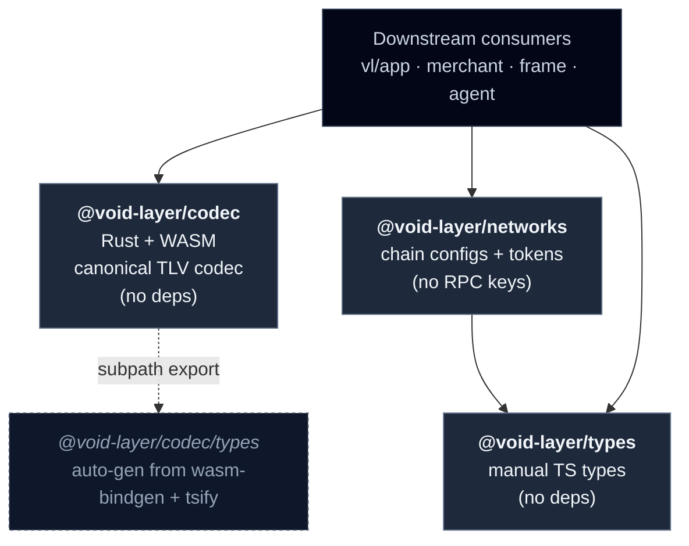
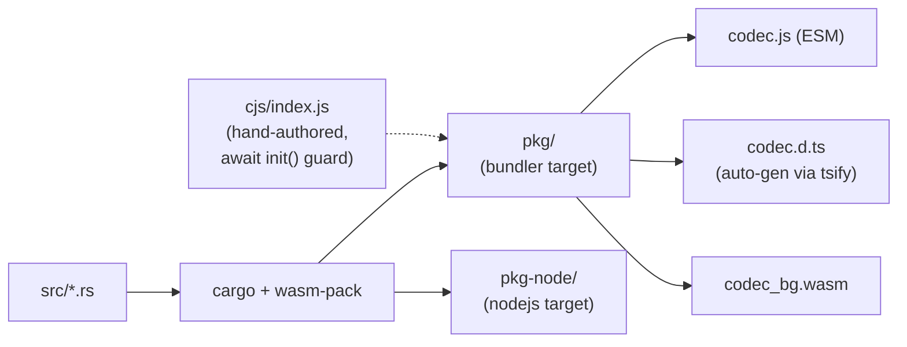
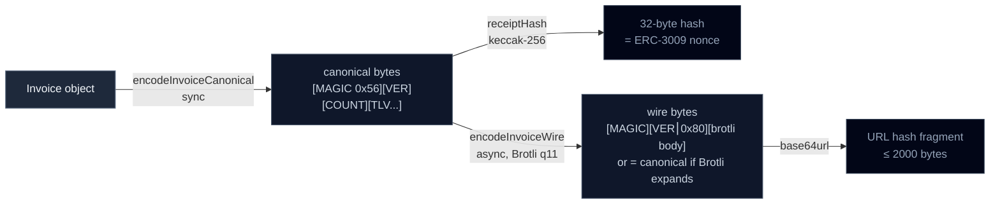

# @void-layer Architecture Overview

## Monorepo Structure

## Dependency Rules (Immutable)

- `@void-layer/codec` depends on: **nothing** (pure Rust + auto-gen TS bindings)
- `@void-layer/types` depends on: **nothing** (pure TS, no runtime deps)
- `@void-layer/networks` depends on: `@void-layer/types` only
- Downstream packages (agent, merchant, frame) depend on codec + types + networks
- Auto-generated types from `wasm-bindgen` + `tsify` live in `@void-layer/codec/types` subpath export — NOT in `@void-layer/types`

## Build Pipeline (Phase 2+)

## Data Flow — encode / hash / wire

## Decode Flow — strictness invariants (v1)

The v1 decoder is **fail-loud**: any `Ok(Invoice)` means every byte was read with exactly one interpretation. Three classes of input are rejected to prevent semantic divergence between readers (the property `keccak256(canonical) = nonce` requires).

```mermaid
flowchart TD
    bytes[wire / canonical bytes] --> magic{MAGIC = 0x56?}
    magic -->|no| e1[BadMagic]
    magic -->|yes| ver{VER &amp; 0x80?<br/>compressed flag}
    ver -->|set on wire| br[Brotli decompress<br/>≤ MAX_DECOMPRESSED_BYTES]
    ver -->|clear| stream[read_tlv_stream]
    br --> stream
    stream --> can{varint canonical?<br/>no redundant trailing zero}
    can -->|no| e2[InvalidData<br/>non-canonical varint]
    can -->|yes| dup{duplicate tag?}
    dup -->|yes| e3[InvalidData<br/>duplicate TLV tag]
    dup -->|no| unk{unknown tag?<br/>tag ∉ KNOWN_TAGS}
    unk -->|yes| e4[UnknownExtension]
    unk -->|no| ds[verify_domain_separator<br/>keccak256 over records]
    ds -->|mismatch| e5[ChecksumMismatch]
    ds -->|ok| fields[read fields<br/>U256 amounts, UTF-8, salt==16]
    fields --> ok[Ok&#40;Invoice&#41;]

    classDef gate fill:#0f172a,stroke:#475569,color:#f1f5f9
    classDef err fill:#7f1d1d,stroke:#dc2626,color:#fecaca
    classDef ok fill:#14532d,stroke:#22c55e,color:#bbf7d0
    class magic,ver,can,dup,unk,ds gate
    class e1,e2,e3,e4,e5 err
    class ok ok
```

**Why these rejections matter**: in v1 the TLV tag set is closed (LOCKED). An unknown tag in an `Ok(Invoice)` payload means a v2-or-other-platform reader would see fields the v1 reader silently dropped → divergent `keccak256(canonical)` → divergent ERC-3009 nonce. The BOLT12 odd/even extensibility mechanism activates from v2+ (see [contributing-tlv-registry.md](./contributing-tlv-registry.md)); v1 is strictly closed-set.

## Schema Versioning

- **v1 LOCKED** (Constitution IV). Old URLs decode forever.
- **v2 additive** via TLV odd/even rule + `extensions` map (BOLT12 import).
- **Receipt-hash**: `keccak256(canonical_binary_PRE_compression)` (algo-agnostic).

## Compression

- **Wire format v1**: Brotli q11 whole-payload, signaled by `VERSION & 0x80` (LOCKED).
- **v2 runtime branch** (B-iv per spec §3.16):
  1. `'brotli' in CompressionStream.supportedFormats` → native (zero bundle cost)
  2. Else → `brotli-wasm` peerDep fallback (current shipping pattern)

## Encoding

- URL hash fragment: `base64url` (LOCKED v1; default v2)
- QR alphanumeric: `Crockford32` (v1.3+, gated on >15% QR share analytics)
- EVM calldata: `hex`
- Solana account data: `base58`

## Hard Limits

| Limit | Value | Enforced where |
|-------|-------|----------------|
| WASM blob (gzipped) | < 80 KB | `scripts/assert-size.sh` (CI) |
| npm package total | < 200 KB | `scripts/assert-size.sh` (CI, advisory) |
| URL max (after base64url) | 2000 bytes | application layer (codec emits raw bytes) |
| Notes max | 280 characters | **application layer** — the codec does NOT enforce this. v1 reference implementations measure in Unicode code points (the unit JS `String.length` does NOT use). Platforms adopting `@void-layer/codec` MUST validate before encode. |
| Salt length | exactly 16 bytes | codec (decode rejects with `ChecksumMismatch` otherwise) |
| TLV value | < 4096 bytes | codec (decode rejects with `MAX_VALUE_SIZE` guard) |
| TLV count per payload | ≤ 64 | codec (decode rejects with `MAX_TLV_COUNT` guard) |
| LEB128 varint | ≤ 37 bytes | codec (decode rejects with `VarintOverflow`) |

## Receipt-hash safety

`receiptHash(canonical_bytes)` is keccak-256 over arbitrary input — it hashes whatever bytes you pass it. The ERC-3009 nonce contract requires the hash to be taken over the **canonical** form of the invoice.

**ALWAYS**: pass the output of `encodeInvoiceCanonical(invoice)` to `receiptHash`. Re-encode from the decoded Invoice if you need a hash from received bytes.

**NEVER**: hash received bytes directly. A non-canonical varint or duplicate tag in the received payload would produce a different keccak input than the same logical invoice encoded fresh, even though the v1 decoder now rejects both classes (see decode flow above). Hashing received bytes makes the nonce dependent on the producer's encoder rather than the canonical form.

A type-safe `receiptHash(invoice: Invoice)` surface that performs the canonical encode internally is on the v0.2 roadmap.

## See also

- **Spatial view**: [`architecture.canvas`](./architecture.canvas) — Obsidian Canvas (JSON Canvas 1.0) panel layout of the same content for non-linear browsing
- **Decoder strictness threat model**: [`../SECURITY.md#decoder-strictness-invariants-v1`](../SECURITY.md#decoder-strictness-invariants-v1)
- **Test corpus**: [`packages/codec/docs/golden-vectors.md`](../packages/codec/docs/golden-vectors.md) — Tier 1 (frozen golden) + Tier 2 (parametric corpus)
- **TLV registry**: [`packages/codec/REGISTRY.md`](../packages/codec/REGISTRY.md) (canonical type-IDs) + [`contributing-tlv-registry.md`](./contributing-tlv-registry.md) (allocation process)

## References

- Full spec: `voidpay-ai/ops/specs/056-void-layer-codec-extraction/spec.md`
- ADR-supersession: `voidpay-ai/agent-memory/advisors/decisions/2026-05-09-kai-cto-codec-rust-supersedes-ts-first.md`
- Constitution: VoidPay Principle IV (Perpetual + Schema versioning)
